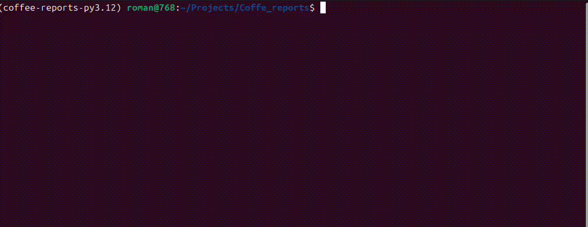

# Потребление кофе студентами

Небольшой консольный инструмент на Python, который читает CSV-файлы с данными о подготовке студентов к экзаменам и формирует отчёт `median-coffee` - медианные траты на кофе по каждому студенту за весь период.

## Требования

- Python 3.12+
- Poetry
- (опционально) `make` для удобных команд

## Архитектура

Проект логически делится на несколько слоёв:

- `main.py` - входная точка и CLI (парсинг аргументов, запуск отчёта, вывод результата).
- `src/loader/` - загрузка и разбор CSV-данных.
- `src/reports/` - отчёты и их расчёты.
- `src/utils/` - вспомогательные утилиты (реестр отчётов, вывод таблиц).

Пример структуры:

```text
.
├─ main.py              # CLI: парсинг аргументов, запуск отчёта
├─ src/
│  ├─ loader/
│  │  └─ data_loader.py # чтение и разбор CSV
│  ├─ reports/
│  │  ├─ base.py        # базовый класс отчёта
│  │  └─ median_coffee.py
│  └─ utils/
│     ├─ registry.py    # реестр отчётов
│     └─ table_printer.py
```

## Ограничения и зависимости

- Основная логика (парсинг аргументов, чтение CSV, расчёт отчёта) использует только стандартную библиотеку Python (`argparse`, `csv`, `statistics` и т.п.).
- Для форматирования табличного вывода в консоль используется `tabulate`.
- Для тестов и разработки используются дополнительные инструменты (pytest, линтеры и т.д.), они подключены через Poetry.

## Как установить

Клонируйте и установите зависимости:

```bash
git clone https://github.com/<user>/coffee-reports.git
cd coffee-reports
poetry install
```

Если установлен `make`:

```bash
make install
```

Если не установлен `make`:
- linux: `sudo apt update && sudo apt install make`
- mac: `brew install make`

На Windows можно запускать команды без `make`, см. примеры ниже.

## Примеры запуска скрипта

### Через `make`

```bash
make run
```

### Без `make`

```bash
poetry run python main.py \
  --files data/math.csv data/physics.csv data/programming.csv \
  --report median-coffee
```

В консоли будет выведена таблица с именами студентов и медианными тратами на кофе, отсортированная по убыванию.

Пример вывода:



### Обработка ошибок

- Если указаны несуществующие файлы в `--files`, скрипт выводит понятное сообщение об ошибке и завершает работу с ненулевым кодом.
- Если указан неизвестный отчёт в `--report`, выводится сообщение об ошибке с перечислением доступных отчётов.
- Текст всех сообщений об ошибках на русском языке.

## Тесты и инструменты для разработчиков

Запуск тестов:

```bash
make test
```

или без `make`:

```bash
poetry run pytest
```

Тестами покрыт функционал:

- загрузка и разбор CSV‑данных;
- расчёт медианных трат по студентам;
- поведение CLI при корректных и ошибочных параметрах (`--files`, `--report`).


Проверка стиля и форматирование (если нужно):

```bash
make lint      # ruff
make format    # black + ruff format
```